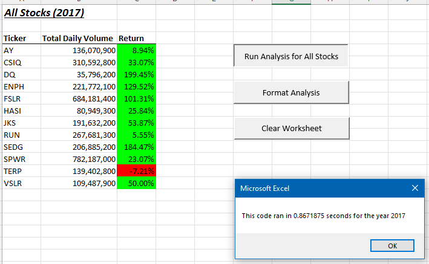
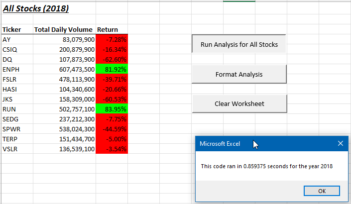
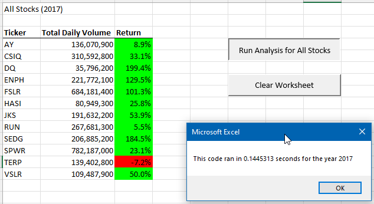
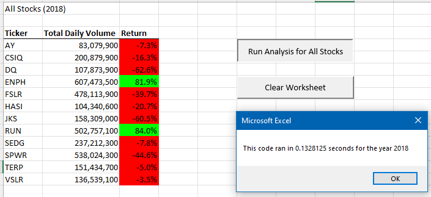

# Stock Analysis Code Refactoring
  
## Project Overview

The purpose of this project was to refactor our "All Stocks Analysis" code written in VBA with Excel to handle a larger data set and run more efficiently. While the initial version worked well for a dozen stocks, our customer Steve wants to expand the dataset to analyze the entire stock market over the last few years. Our original code is not ideal for such a large-scale analysis and would likely take a long time to execute. Our goal was to create "clean," well-structured code through the refactoring process and to evaluate the effects of our efforts.  

## Results

### Stock Performance

In 2017, nearly all stocks realized positive yearly returns ranging from +5.55% to +199.45% (DQ). Only TERP had a negative yearly return of -7.21% in 2017. Based on DQ's performance in 2017, it is understandable that Steve's parents were eager to invest in DQ stock.

With his parents' financial interests in mind, Steve pursued additional analysis revealing that 2018 was not a good year for the stock market. Only 2 stocks had positive returns for the year: ENPH (81.92%) and RUN (83.95%). All others performed poorly for a variety of reasons outlined here: 
(https://www.pbs.org/newshour/economy/making-sense/6-factors-that-fueled-the-stock-market-dive-in-2018).
 
Given that 2018 was not a good year for the stock market, it makes sense that Steve wants to expand his dataset to continue analyzing stocks before his parents make their investment decision. 

### Code Execution Times: Original Code vs. Refactored Code

Before we compare execution times for our original code versus refactored code, it is important to note some similarities between them: 
- The output of both versions of code is exactly the same.
- We employed the technique of arrays and nested loops in both versions.

- **Original Code:**
  - The original code utilized **only one array for "tickers."** We then declared **specific variables** for "startingPrice" and "endingPrice". We then looped through the data a ticker at a time, which populated the output one row at a time for the current ticker. Because we evaluated each ticker individually, we had to loop through the data 12 times.
  - **Code execution times** for the 2017 analysis and 2018 analysis using the **original code** were **0.87 seconds and 0.86 seconds** respectively.
  - See the Original Nested Loop code below along with screenshots of the code execution times.  
- **Original Nested Loop:**
```ruby
For i = 0 To 11
    
        ticker = tickers(i)
        totalVolume = 0
    
        '5) Loop through rows in the data.
        
         Worksheets(yearValue).Activate
         For j = 2 To RowCount
                
        '5a) Find total volume for the current ticker.
        
        If Cells(j, 1).Value = ticker Then
        
            totalVolume = totalVolume + Cells(j, 8).Value
            
        End If
        
        '5b) Find starting price for the current ticker.
        
         If Cells(j, 1).Value = ticker And Cells(j - 1, 1).Value <> ticker Then
        
            startingPrice = Cells(j, 6).Value
        
        End If
        
        '5c) Find ending price for the current ticker.
        
        If Cells(j, 1).Value = ticker And Cells(j + 1, 1).Value <> ticker Then
        
            endingPrice = Cells(j, 6).Value
            
        End If
        
    Next j
        
    '6) Output the data for the current ticker.
            
    Worksheets("All Stocks Analysis").Activate
    Cells(4 + i, 1).Value = ticker
    Cells(4 + i, 2).Value = totalVolume
    Cells(4 + i, 3).Value = (endingPrice / startingPrice) - 1
    
Next i
```

**2017 Code Execution Time: Original Code**



**2018 Code Execution Time: Original Code**



  - **Refactored Code:**
    - The refactored code expanded utilization of arrays to **four arrays: tickers, tickerVolumes, tickerStartingPrices, and tickerEndingPrices.** As we looped through the data, we stored the data in the four different arrays and then "dumped" all of the output into our "All Stocks Analysis" worksheet at the end.    
    - This strategy facilitated a complete analysis of all stocks after only one loop through the data rather than looping through it twelve times (i.e. once per ticker) as we did in the original version. This resulted in **greatly improved execution times** when we compared the original code to the refactored code. 
    - See the Refactored Nested Loop code below along with screenshots of the improved code execution times.
  - **Refactored Nested Loop:**
```ruby
''2b) Loop over all the rows in the spreadsheet.
    
    For i = 2 To RowCount
    
        ticker = tickers(tickerIndex)
    
        '3a) Increase volume for current ticker
        If Cells(i, 1).Value = ticker Then
        
            tickerVolumes(tickerIndex) = tickerVolumes(tickerIndex) + Cells(i, 8).Value
            
        End If
                
        '3b) Check if the current row is the first row with the selected tickerIndex.
            'If is, then assign current starting price to the tickerStartingPrices variable
        'If  Then
        
        If Cells(i, 1).Value = ticker And Cells(i - 1, 1).Value <> ticker Then
        
            tickerStartingPrices(tickerIndex) = Cells(i, 6).Value
                    
        End If
        
        '3c) check if the current row is the last row with the selected tickerIndex
            'If is, assign the current closing price to the tickerEndingPrices variable
            
        If Cells(i, 1).Value = ticker And Cells(i + 1, 1).Value <> ticker Then
        
            tickerEndingPrices(tickerIndex) = Cells(i, 6).Value
        
        End If
                    
        '3d Increase the tickerIndex if the next row's ticker doesn't match previous row's ticker.
        'If  Then
        
        If Cells(i, 1).Value = ticker And Cells(i + 1, 1).Value <> ticker Then
        
            tickerIndex = tickerIndex + 1
            
        End If
        
    Next i
    
    '4) Loop through your arrays to output the Ticker, Total Daily Volume, and Return.
    
    For tickerIndex = 0 To 11
        
        Worksheets("All Stocks Analysis").Activate
        
        Cells(4 + tickerIndex, 1).Value = tickers(tickerIndex)
        Cells(4 + tickerIndex, 2).Value = tickerVolumes(tickerIndex)
        Cells(4 + tickerIndex, 3).Value = (tickerEndingPrices(tickerIndex) / tickerStartingPrices(tickerIndex)) - 1
        
    Next tickerIndex
```
**2017 Code Execution Time: Refactored Code**



**2018 Code Execution Time: Refactored Code**



## Project Summary

- **Advantages of refactoring code:**
  - By refactoring already existing code, we have the benefit of not starting from scratch. We have something to work with. 
  - As a result of the refactoring process, the code is cleaner, takes up less memory, is more efficient, and should help the program run faster. This is especially beneficial from a scalability perspective since it is easier to update the code and/or add new functionality to already well-structured code.
  - The refactored code is easier for others to read and understand if comments and white space are utilized, including the appropriate indentation (e.g. loops). Therefore, it may be easier for future developers to comprehend the code, maintain it, and make alterations in a timely manner. 
- **Disadvantages of refactoring code:** 
  - As I learned from this challenging effort, it is very time consuming. Time lost here may be worth it given some of the time-saving advantages noted above.
  - Any mistakes within the original code that aren't identified will be carried over to the refactored code.  
  - For me, it was difficult to refactor already existing code because it was hard to think "outside the box" with the code in front of me. (It also may be due to how new all of these concepts are for me.) This should improve as I get more comfortable with fundamental programming concepts.   
- **How do these pros and cons apply our refactoring of the original VBA script?**
  - By refactoring our code, the code execution times were greatly improved. The code execution time for the 2017 analysis improved from 0.87 seconds to 0.14 seconds. The code execution time for the 2018 analysis improved from 0.86 seconds to 0.13 seconds. Given this information, I am confident that the refactored code would be able to handle a larger data set for Steve's analysis.  
